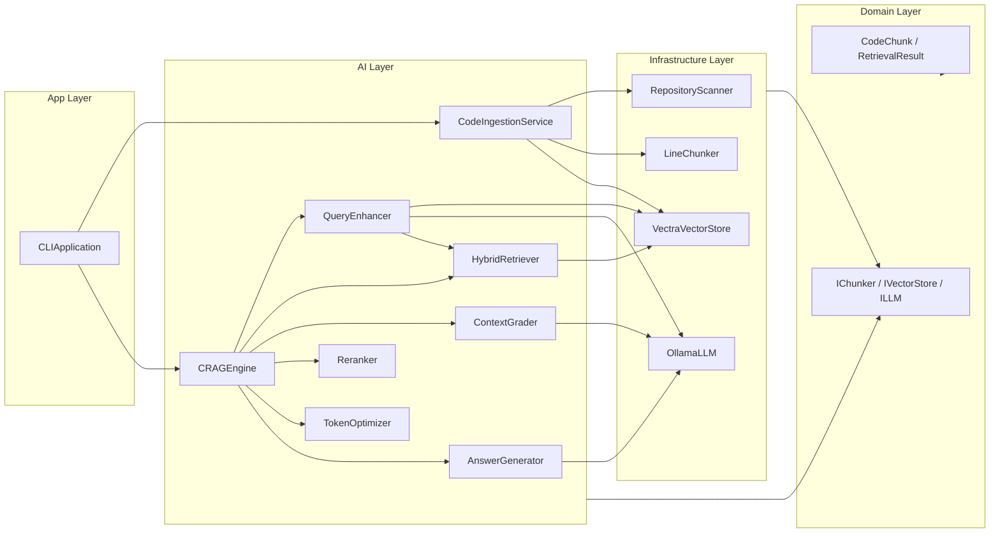
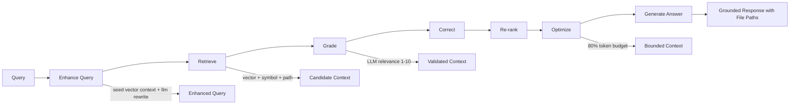

# NodeSage

[](https://www.typescriptlang.org/)
[](https://nodejs.org/)
[](https://ollama.com/)
[](https://www.npmjs.com/package/vectra)
[](https://www.npmjs.com/package/commander)

NodeSage is a TypeScript CLI implementing a production-style CRAG engine for codebase Q&A.

Pipeline:

`Enhance Query -> Retrieve -> Grade -> Correct -> Re-rank -> Optimize -> Generate`

## System Overview



## CRAG Runtime Flow



## Quick Start

### 1. Install

```bash
npm install
```

### 2. Start Ollama and pull models

```bash
ollama serve
ollama pull qwen2.5-coder:7b
ollama pull nomic-embed-text
```

### 3. Build

```bash
npm run build
```

### 4. Ingest codebase

```bash
node dist/index.js ingest .
```

### 5. Ask question

```bash
node dist/index.js ask "Where is auth logic implemented?"
```

## Commands

- `ingest [repo]`: scan repository, chunk files, embed, and index.
- `ask <query>`: execute full CRAG pipeline (including query enhancement) and generate grounded answer.

## Configuration

Environment variables:

- `NODESAGE_CHAT_MODEL` default `qwen2.5-coder:7b`
- `NODESAGE_EMBED_MODEL` default `nomic-embed-text`
- `NODESAGE_TEMPERATURE` default `0.1`
- `NODESAGE_MAX_TOKENS` default `6000`

Index path:

- `~/.nodesage/crag-index`

## Project Structure

```text
src/
  domain/
    models/
    interfaces/
  infrastructure/
    llm/
    vectorstore/
    filesystem/
  ai/
    crag/
  app/
    cli/
```

## Documentation

- [docs/README.md](./docs/README.md)
- [docs/architecture.md](./docs/architecture.md)
- [docs/crag-pipeline.md](./docs/crag-pipeline.md)
- [docs/cli.md](./docs/cli.md)

## Development

```bash
npm run build
node dist/index.js --help
```
