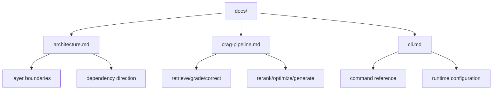

# NodeContext Docs

Implementation documentation for the CRAG-based NodeContext CLI.

## Documentation Map

## Contents

- [Architecture](./architecture.md)
- [CRAG Pipeline](./crag-pipeline.md)
- [CLI Usage](./cli.md)
