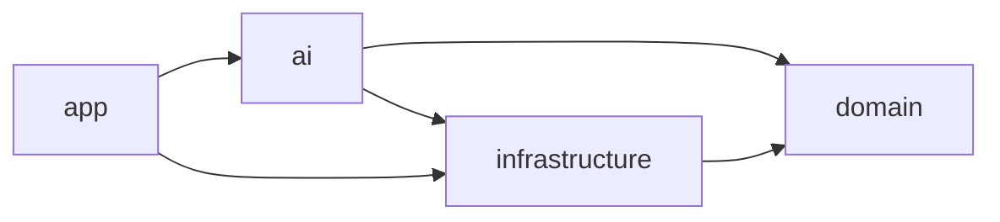
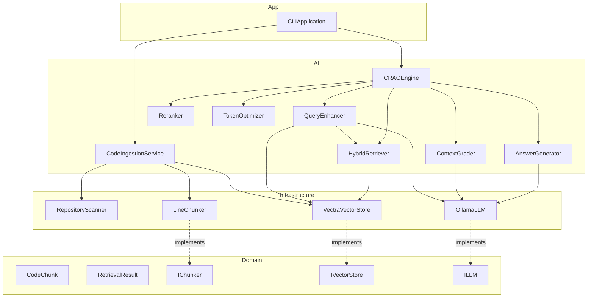
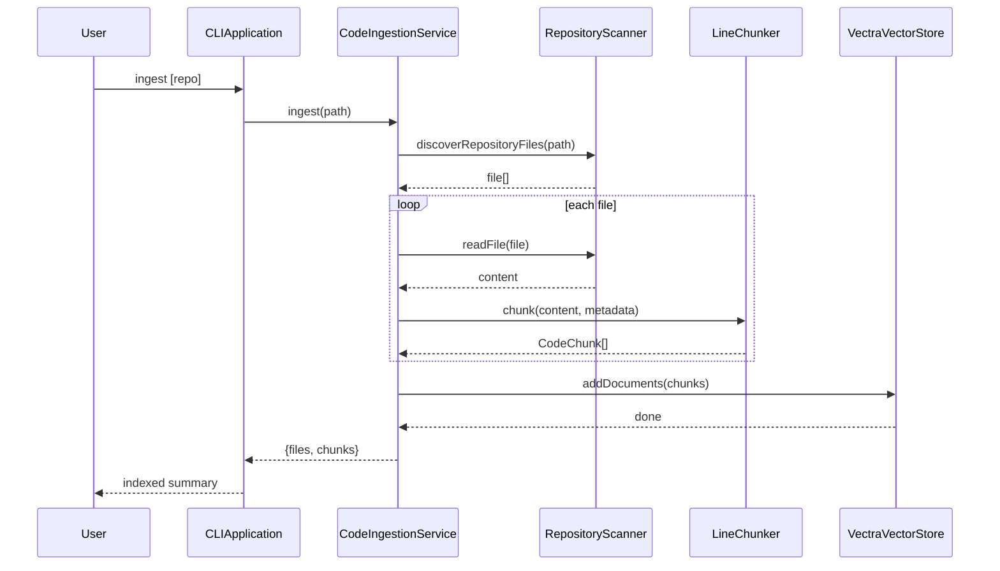
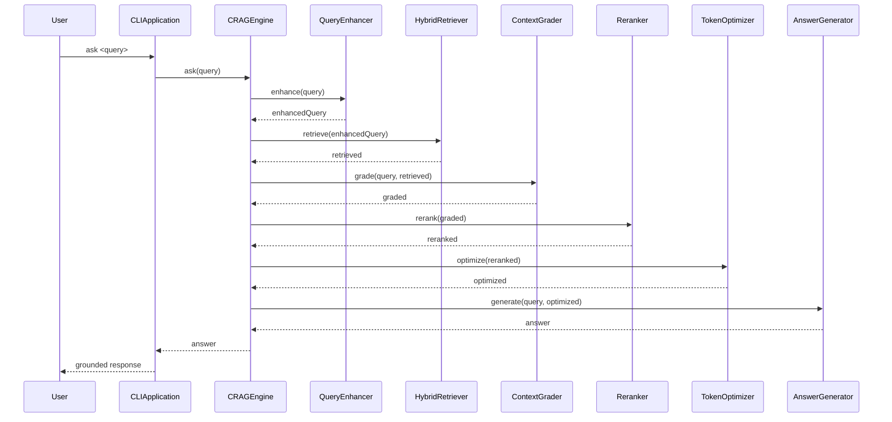

# Architecture

## Layer Boundaries

- `domain`: models and interfaces only
- `infrastructure`: SDK adapters only
- `ai`: CRAG orchestration and logic
- `app`: CLI entry and composition root

## Layer Dependency Graph

## Component Map

## Runtime Sequences

### Ingestion Sequence

### Query Sequence

