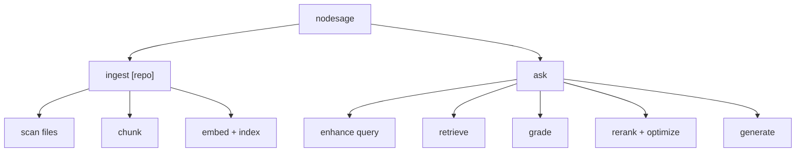

# CLI Usage

## Command Surface



## Build

```bash
npm run build
```

## Ingest

```bash
node dist/index.js ingest .
node dist/index.js ingest /absolute/path/to/repo
```

## Ask

```bash
node dist/index.js ask "Where is validation logic implemented?"
node dist/index.js ask "Show risky file access patterns"
```

## Runtime Configuration

Environment variables:

- `NODESAGE_CHAT_MODEL`
- `NODESAGE_EMBED_MODEL`
- `NODESAGE_TEMPERATURE`
- `NODESAGE_MAX_TOKENS`

Example:

```bash
NODESAGE_CHAT_MODEL=qwen2.5-coder:7b \
NODESAGE_EMBED_MODEL=nomic-embed-text \
NODESAGE_TEMPERATURE=0.1 \
NODESAGE_MAX_TOKENS=6000 \
node dist/index.js ask "How does ingestion work?"
```

## Help

```bash
node dist/index.js --help
```
