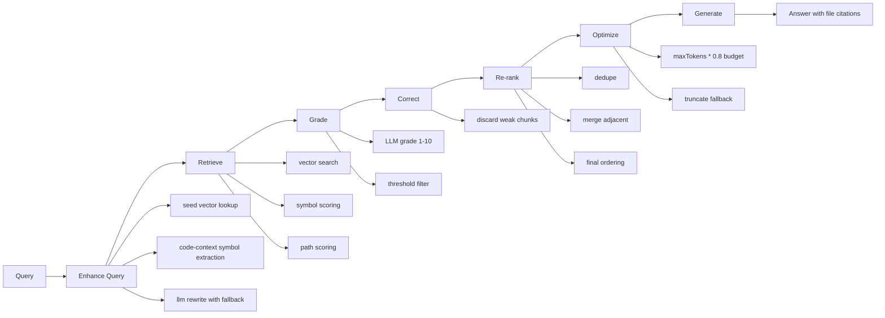
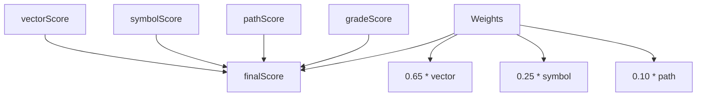

# CRAG Pipeline

NodeContext uses this pipeline:

`Enhance Query -> Retrieve -> Grade -> Correct -> Re-rank -> Optimize -> Generate`

## End-to-End Diagram

## 0. Enhance Query

`QueryEnhancer` performs a pre-retrieval expansion step:

- fetches seed chunks from vector search
- extracts file-path and symbol hints from seed context
- asks the LLM for a strict-JSON rewritten query
- falls back to deterministic query expansion if parsing fails

## Scoring Formula

`HybridRetriever` computes:

`finalScore = vectorScore * 0.65 + symbolScore * 0.25 + pathScore * 0.10`

`ContextGrader` adds LLM relevance signal as `gradeScore` and filters chunks below threshold.

## Prompt Contract

`AnswerGenerator` enforces:

- cite file paths for claims
- avoid hallucinated files/APIs
- if insufficient evidence, return `Insufficient context`

## Data Contract

- input: user query string
- retrieval unit: `RetrievalResult`
- output: grounded answer string
